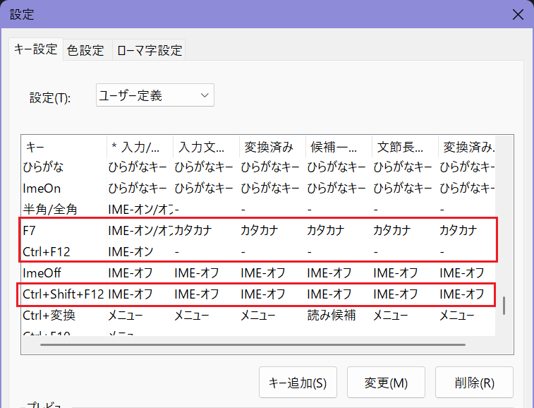
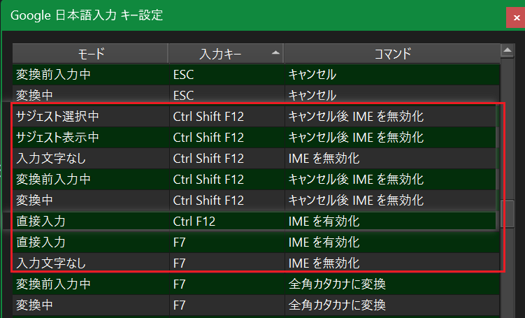
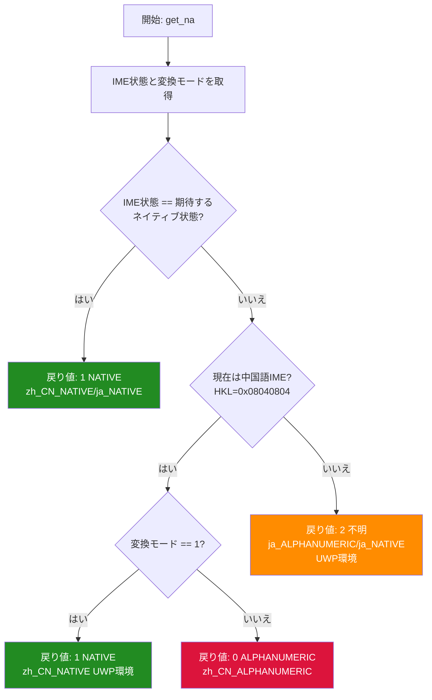

# IMESwitch

AutoHotkey v2 ベースのインテリジェントな IME 切り替えツール。中国語と日本語 IME のシームレスな切り替えをサポート。

## 機能概要

物理キーによる高速な入力言語・入力モードの切り替え：
- `変換キー` (Henkan): 日本語 IME に切り替え
- `無変換キー` (Muhenkan): 中国語 IME に切り替え
- `ひらがなカタカナローマ字キー` (Kana): 現在の IME 内で入力モードを切り替え
- 同じキーの連続押下でネイティブ入力モードと英数字モードを切り替え

## 設定要件

### 日本語 IME 設定

#### Microsoft IME の設定：

1. **IME ON ホットキー**: `Ctrl + F12`

2. **IME OFF ホットキー**: `Ctrl + Shift + F12`  
    - このキーは既存の IME OFF キーからコピーする必要がある
    - そうしないと全ての欄をIME-オフに設定できないみたい

3. **IME ON/OFF 切り替え**: `F7`
    - 無入力を IME-オン/オフ に設定、他は維持でOK



#### Google 日本語入力の設定：

1. **IME ON ホットキー**: 
    - 直接入力モードを `Ctrl + F12` と `F7` に設定

2. **IME OFF ホットキー**:
    - 入力文字なしモードを `Ctrl + Shift + F12`  と `F7` に設定

3. **キャンセル後IMEを無効化ホットキー**: 
    - サジェスト選択中、サジェスト表示中、変換前入力中、変換中モードで `Ctrl + Shift + F12`  に設定
  



### 中国語 IME 設定

#### Microsoft Pinyin の設定：

1. **中英文切り替え**: `Ctrl + Space`
    - 通常はデフォルト設定

### Kana キーの動作

- **日本語モード**: F7 キー送信（IME 切り替え or ひらがな→カタカナ変換）
- **中国語モード**: Ctrl + Space 送信（中英文切り替え）

**注意**: 入力中の文字列がある場合とない場合で動作が異なる

## 技術実装

### コアコンポーネント

- **ime_switch.ahk**: メインスクリプト、言語切り替えロジックを含む
- **IMEv2.ahk/**: IME 制御ライブラリ、AutoHotkey v1 から移植
  - IMM32 API を通じて直接 IME 状態を制御
  - GUIThreadInfo を使用して正しいウィンドウハンドルを取得

### 互換性対応

異なるアプリケーションタイプに対する特別な処理を含む：
- **従来のデスクトップアプリ**: IME 状態と変換モードで直接判定
- **UWP アプリ**: API 制限により、ホットキー送信のフォールバック方式を採用

### 状態検出ロジック

```
get_na() 戻り値：
0: 英数字モード (ALPHANUMERIC)  
1: ネイティブ入力モード (NATIVE)
2: 不明 (通常は UWP アプリ中の日本語 IME)
```

#### 検出フロー



**判定基準:**
- **中国語 IME**: 
  - IME状態=1 かつ 変換モード=1 → NATIVE
  - IME状態=0 かつ 変換モード=1 → NATIVE (UWP)
  - IME状態=0 かつ 変換モード=0 → ALPHANUMERIC
- **日本語 IME**: 
  - IME状態=1 かつ 変換モード=25 → NATIVE
  - その他の状態 → 不明 (UWP環境制限)

## 既知の問題

**UWP アプリ互換性**: 一部の UWP アプリで IME 状態の精密な検出ができず、ホットキー切り替えに依存

## デバッグ機能

- `logging := true` で詳細ログ記録を有効化
- `debugging_tooltip := true` でリアルタイム状態表示を有効化
- ログファイル: `ime_switch.log`

## サポート対象 IME

- 日本語: Microsoft IME (HKL: 0x04110411)
- 中国語: Microsoft Pinyin (HKL: 0x08040804)

## 参考資料

- IMEv2.ahk ライブラリは [k-ayaki/IMEv2.ahk](https://github.com/k-ayaki/IMEv2.ahk) をベース
- 元の IME.ahk は AutoHotkey コミュニティ由来 (NYSL ライセンス)
